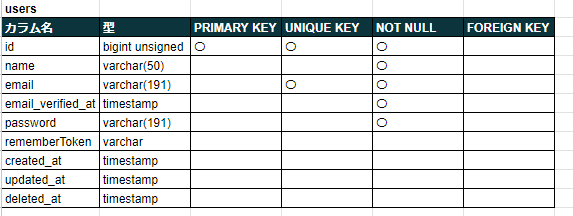

## アプリケーション情報

■ アプリケーション名 
・Boad 

■ プロダクト概要 
ユーザーが購入した本を管理するためのアプリ 

■ トップ画像 

## アプリケーション URL
https://books.waterfall32-breeze.com/

## 使用技術(実行環境)
■ 使用言語 
HTML 
CSS 
JavaScript 
PHP 8.2.13 

■ 使用フレームワーク 
Laravel Framework 10.32.1 

■ 認証スターターキット 
Fortify 

■ メール認証 
Mailpit(local環境) 

## 機能一覧
新規登録 
ログイン 
メール認証 
パスワードリセット 
図書一覧表示 
図書お気に入り一覧表示 
図書ランキング表示 
図書追加 
図書詳細表示 
図書更新 
図書削除 
図書評価 
図書のお気に入り登録と削除 
著者一覧表示 
著者追加 
著者更新 
著者削除 
ジャンル一覧表示 
ジャンル追加 
ジャンル更新 
ジャンル削除 

## テーブル設計

## ER 図

## 画面遷移図

## 環境構築
■ 開発環境 
[土台] 
Docker(Laravel Sail) 
LinuxOS 
[操作] 
ubuntu 
VSCode 
[サーバー] 
nginx 
[データベース] 
mysql 
[管理] 
Git 
GitHub 

## その他
■ ログイン用ダミーデータ 
・1件 
・メールアドレス：test1@test.com 
・パスワード　　：test1111 

■ 図書ダミーデータ 
・5件 
